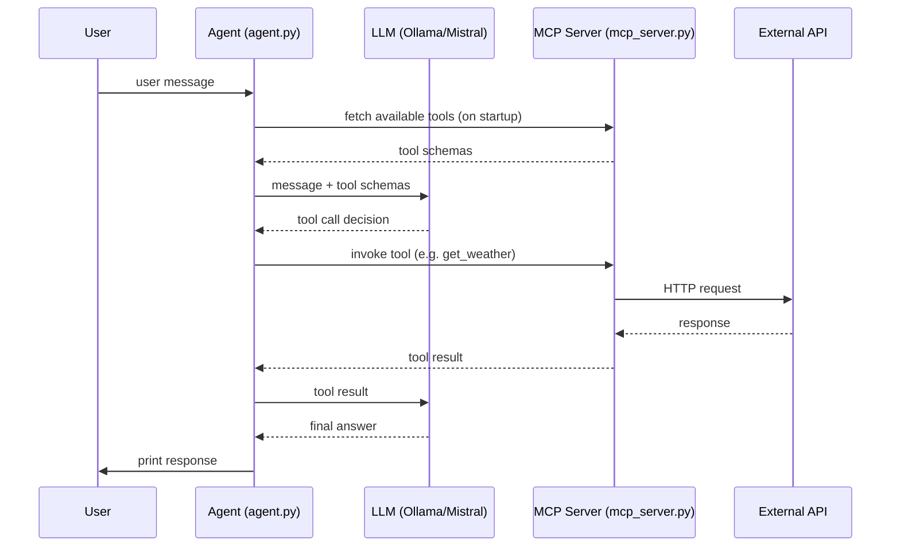

# Agent Zero

A minimal agent built to learn how LLMs, tool use, and MCP servers fit together. It wires up a local LLM (via Ollama) to an MCP server that exposes real-world tools — just enough to understand the core loop without any extra abstractions.

## Setup

```bash
uv sync
```

## Running Ollama

Download and install Ollama from [ollama.com](https://ollama.com/download).

Start the model server and pull the model:

```bash
ollama serve
ollama pull mistral
```

Test it responds:

```bash
ollama run mistral "Hello, how are you?"
```

## Model Context Protocol (MCP)

MCP is an open standard that lets LLMs discover and call external tools at runtime. The agent connects to an MCP server over a network transport and receives a list of available tools with their schemas.

A tool is defined by wrapping a Python function with the `@mcp.tool` decorator. The function's name, parameters, and docstring are automatically exposed as the tool's schema so the LLM knows how to call it.

### Tools defined in [mcp_server.py](mcp_server.py)

| Tool | Description |
|---|---|
| `get_weather(city)` | Fetches current weather for a city (temperature, humidity, wind, etc.) via wttr.in |
| `get_news(topic)` | Fetches the latest 5 news headlines for a topic via Google News RSS |

### Running the MCP server

```bash
python mcp_server.py
```

The server starts on `http://0.0.0.0:8000` using SSE transport.

## Architecture



## Agent

[agent.py](agent.py) is a minimal ReAct agent loop — just enough to wire together an LLM, a set of MCP tools, and a user input prompt.

1. **LLM** — `ChatOllama` loads the `mistral` model running locally via Ollama.
2. **MCP client** — `MultiServerMCPClient` connects to the MCP server over SSE and fetches the available tools at startup.
3. **Agent** — `create_react_agent(llm, tools)` wraps the model and tools into a ReAct orchestrator. On each turn it decides whether to call a tool or answer directly, then returns the final response.
4. **Loop** — a simple `while True` reads user input, invokes the agent, and prints the reply. Type `quit` or `exit` to stop.

> **ReAct** (Reason + Act) is the pattern where the LLM alternates between reasoning about what to do and acting by calling a tool, until it has enough information to answer.

### Running the agent

Make sure the MCP server is already running, then:

```bash
python agent.py
```
