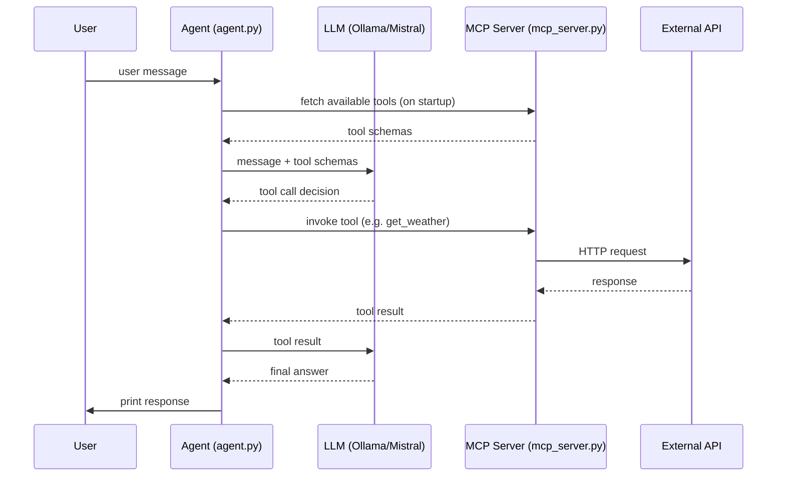

# Agent Zero

My attempt at building the most basic version of an Aent in the hopes of learning how to it works :)
I will be using an mcp server to expose tools and ollama to serve the models

## Running ollama 
The first step is to serve the LLM model through ollama. Then we would be

```bash
ollama serve
ollama pull mistral 
```
Test out that the model is responding by sending a message :
```bash
ollama run mistral "Hello, how are you?"
```

## Model Context Protocol (MCP)

MCP is an open standard that lets LLMs discover and call external tools at runtime. The agent connects to an MCP server (over a network transport) and gets a list of available tools.

A tool is defined by wraping a python function using the `@mcp.tool` decorator. This registers the python function as an MCP-callable tool. The function's name, parameters, and docstring are automatically exposed as the tool's schema so the LLM knows how to call it.

### Tools defined in `mcp_server.py`

| Tool | Description |
|---|---|
| `get_weather(city)` | Fetches current weather for a city (temperature, humidity, wind, etc.) via wttr.in |
| `get_new(topic)` | Fetches the latest 5 news headlines for a topic via Google News RSS |

### Running the MCP server

```bash
python mcp_server.py
```

The server starts on `http://0.0.0.0:8000` using SSE transport.

## Architecture



## Agent

`agent.py` is a very basic agent loop — just enough to wire together an LLM, a set of MCP tools, and a user input prompt.

1. **LLM** — `ChatOllama` loads the `mistral` model running locally via Ollama.
2. **MCP client** — `MultiServerMCPClient` connects to the MCP server over SSE and fetches the available tools at startup.
3. **Agent** — `create_agent(llm, tools)` wraps the model and tools into an orchestrator. On each turn it decides whether to call a tool or answer directly, then returns the final response.
4. **Loop** — a simple `while True` reads user input, invokes the agent, and prints the reply. Type `quit` or `exit` to stop.

### Running the agent

Make sure the MCP server is already running, then:

```bash
python agent.py
```
